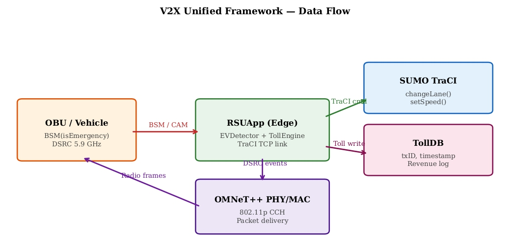
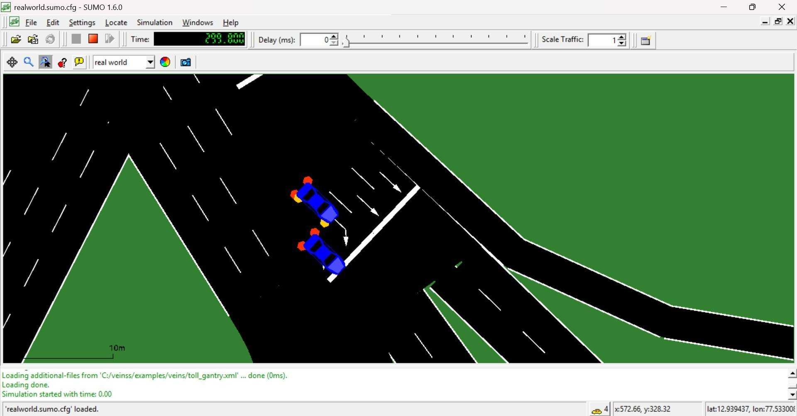
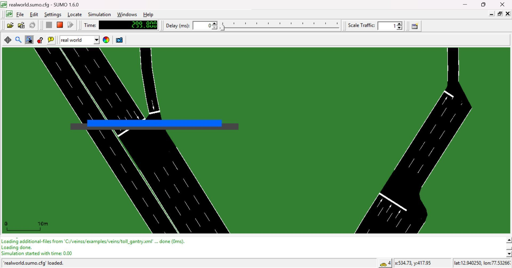

# Unified V2X Framework for Emergency Lane Clearing and Contactless Toll Collection 🚗

This repository presents a V2X-based intelligent traffic management system that integrates emergency vehicle lane clearing and contactless toll collection within a single roadside unit (RSU). The system is implemented using SUMO, OMNeT++, and Veins, and leverages IEEE 802.11p (DSRC) communication.

---

## Overview

Urban traffic congestion delays emergency response due to the lack of coordinated lane clearance. Conventional toll systems further increase delays. This work addresses both challenges using a unified RSU-based approach that:

* Detects emergency vehicles using Basic Safety Messages (BSM)
* Issues real-time lane change commands via TraCI
* Processes toll transactions within the same system
* Prevents spoofing through whitelist validation

---

## Key Contributions

* Unified RSU application handling both lane clearing and tolling
* Reduction of unnecessary lane changes by up to 96.7%
* Constant detection latency of 5 ms using V2X communication
* 100% toll accuracy with zero false exemptions under spoofing attacks
* Evaluation on a real-world Bengaluru OSM road network

---

## System Architecture



The architecture illustrates the interaction between vehicles, RSU, and simulation layers using V2X communication.

---

## Results Summary 📊

| Metric            | Baseline  | Proposed V2X |
| ----------------- | --------- | ------------ |
| Lane Changes      | Up to 30  | 1            |
| Reduction         | —         | 96.7%        |
| Detection Latency | 26–177 ms | 5 ms         |
| Toll Accuracy     | Variable  | 100%         |
| Packet Loss       | —         | 0%           |

---

## Simulation Snapshots

### Lane Clearing



### Virtual Toll Gantry



---

## Repository Structure

```bash
veinss/
├── sumo/              
├── omnet/             
├── veins/             
├── results/           
├── figures/           
├── paper/             
```

---

## Setup and Execution ⚙️

1. Install the following dependencies:

   * SUMO
   * OMNeT++
   * Veins

2. Open the project in OMNeT++ IDE:

   * Import the project from the repository
   * Ensure Veins framework is correctly configured

3. Run the simulation:

   * Open the `.ini` configuration file
   * Select the desired scenario
   * Click **Run** in OMNeT++

SUMO will automatically connect via TraCI during execution.

---

## Security Mechanism

The system includes a whitelist-based validation mechanism that verifies emergency vehicle identity using vehicle class information, preventing false PSID-based attacks.

---

## Authors

| Name                   | Title     |
| ---------------------- | --------- |
| Rutuja Bhagat          | Student   |
| Abhimanyu Singh        | Student   |
| Sahil Kalotra          | Student   |
| Bhoomika R P           | Student   |
| Prafullata K. Auradkar | Professor |
